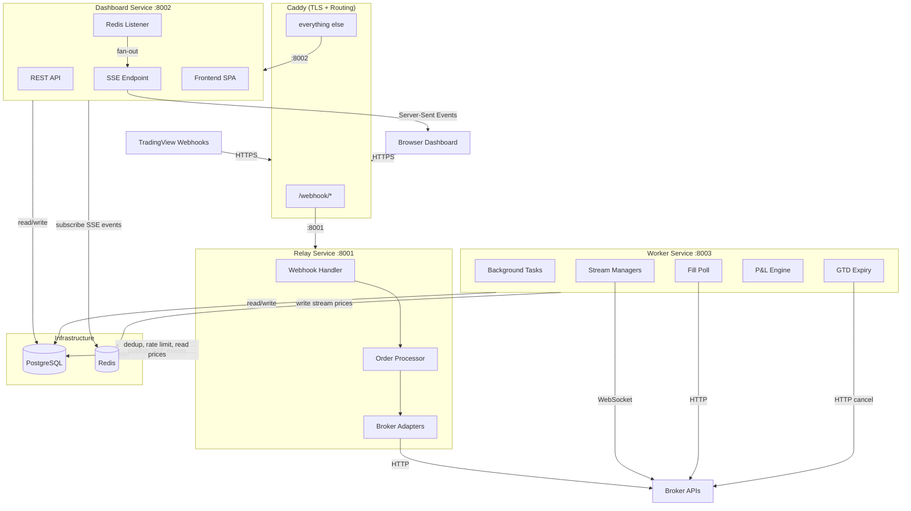
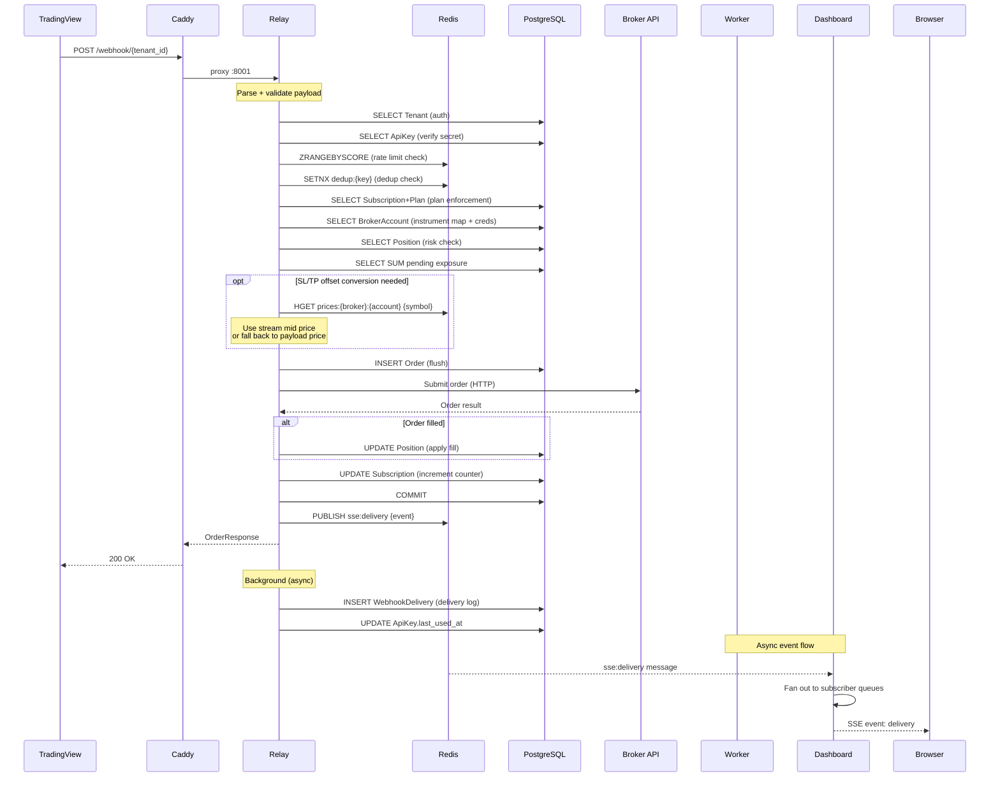
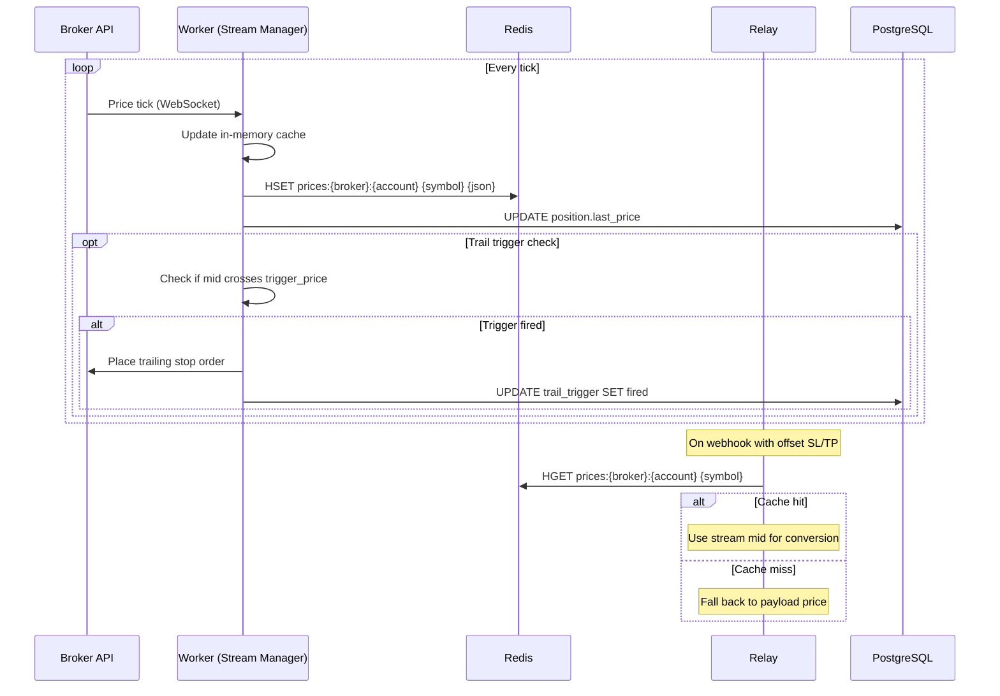
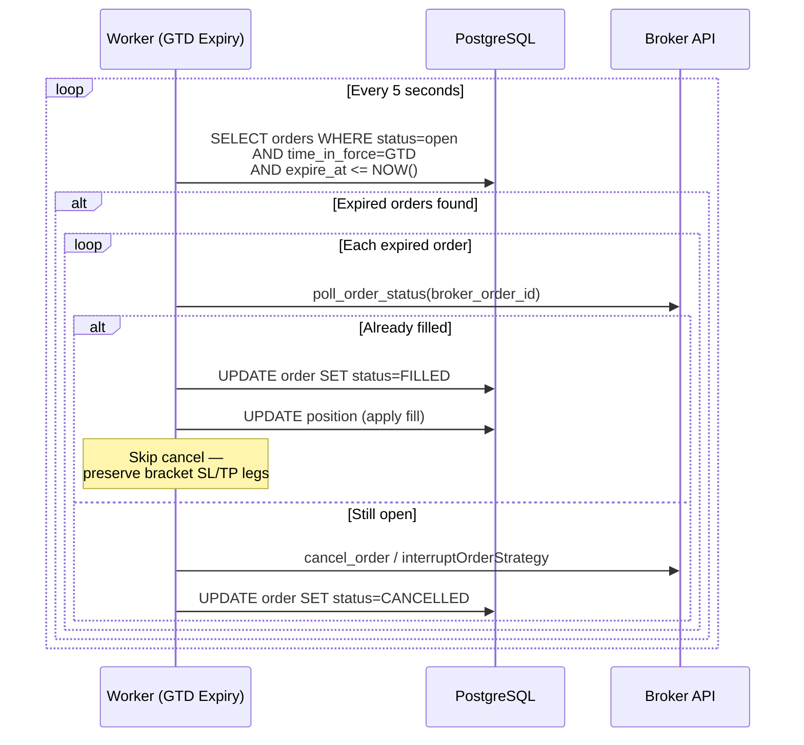

# TV Broker Relay — Architecture

## Service Architecture



## Webhook Processing Flow



## Stream Price Flow



## Data Model (ERD)

```mermaid
erDiagram
    TENANTS {
        uuid id PK
        timestamp created_at
        timestamp updated_at
        varchar email UK
        varchar password_hash
        boolean is_active
        boolean is_admin
        boolean email_verified
    }

    REFRESH_TOKENS {
        int id PK
        uuid tenant_id FK
        varchar token_hash UK
        timestamp created_at
        timestamp expires_at
        boolean revoked
        varchar user_agent
        varchar ip_address
    }

    API_KEYS {
        int id PK
        uuid tenant_id FK
        timestamp created_at
        varchar name
        varchar key_hash UK
        varchar key_prefix
        boolean is_active
        timestamp last_used_at
    }

    PLANS {
        int id PK
        varchar name UK
        varchar display_name
        varchar stripe_price_id
        int max_broker_accounts
        int max_monthly_orders
        int max_open_orders
        int requests_per_minute
        json allowed_order_types
        float max_position_size
        float max_daily_loss
        boolean is_active
    }

    SUBSCRIPTIONS {
        int id PK
        uuid tenant_id FK UK
        int plan_id FK
        timestamp created_at
        timestamp updated_at
        varchar stripe_customer_id
        varchar stripe_subscription_id UK
        varchar status
        timestamp current_period_start
        timestamp current_period_end
        int orders_this_period
    }

    BROKER_ACCOUNTS {
        int id PK
        uuid tenant_id FK
        timestamp created_at
        timestamp updated_at
        varchar broker
        varchar account_alias
        varchar display_name
        text credentials_encrypted
        json instrument_map
        boolean is_active
        boolean fifo_randomize
        int fifo_max_offset
        boolean auto_close_enabled
        varchar auto_close_time
        varchar account_type
        float max_total_drawdown
        float max_daily_drawdown
        float drawdown_floor
        float commission_per_contract
    }

    ORDERS {
        int id PK
        uuid tenant_id FK
        timestamp created_at
        timestamp updated_at
        varchar broker
        varchar account
        varchar symbol
        enum instrument_type "forex equity future cfd option"
        varchar exchange
        varchar currency
        enum action "buy sell close"
        enum order_type "market limit stop stop_limit"
        float quantity
        float price
        enum time_in_force "GTC GTD DAY GFD IOC FOK"
        timestamp expire_at
        float multiplier
        boolean extended_hours
        varchar option_expiry
        float option_strike
        varchar option_right
        float option_multiplier
        float stop_loss
        float take_profit
        float trailing_distance
        float trail_trigger
        float trail_dist
        float trail_update
        enum status "pending submitted open filled partial cancelled rejected error"
        varchar broker_order_id
        varchar client_trade_id
        float broker_quantity
        float filled_quantity
        float avg_fill_price
        float commission
        varchar algo_id
        varchar algo_version
        text raw_payload
        varchar comment
        text error_message
        text broker_request
        text broker_response
    }

    POSITIONS {
        int id PK
        uuid tenant_id FK
        timestamp updated_at
        varchar broker
        varchar account
        varchar symbol
        varchar instrument_type
        float quantity
        float avg_price
        float multiplier
        float realized_pnl
        float daily_realized_pnl
        timestamp daily_pnl_date
        float last_price
        float unrealized_pnl
        timestamp last_price_at
    }

    TRAIL_TRIGGERS {
        int id PK
        uuid tenant_id
        int broker_account_id FK
        int order_id FK
        timestamp created_at
        timestamp updated_at
        varchar broker
        varchar account
        varchar symbol
        varchar direction
        float trigger_price
        float trail_distance
        varchar trade_id
        varchar status "pending fired cancelled error"
        timestamp fired_at
        text error_detail
    }

    WEBHOOK_DELIVERIES {
        int id PK
        uuid tenant_id FK
        timestamp created_at
        varchar source_ip
        varchar user_agent
        text raw_payload
        int http_status
        boolean auth_passed
        int order_id FK
        varchar outcome
        text error_detail
        float duration_ms
        float broker_latency_ms
    }

    TENANTS ||--o{ REFRESH_TOKENS : "has"
    TENANTS ||--o{ API_KEYS : "has"
    TENANTS ||--o| SUBSCRIPTIONS : "has"
    TENANTS ||--o{ BROKER_ACCOUNTS : "has"
    TENANTS ||--o{ ORDERS : "places"
    TENANTS ||--o{ POSITIONS : "holds"
    TENANTS ||--o{ WEBHOOK_DELIVERIES : "receives"
    PLANS ||--o{ SUBSCRIPTIONS : "assigned to"
    BROKER_ACCOUNTS ||--o{ TRAIL_TRIGGERS : "has"
    ORDERS ||--o{ TRAIL_TRIGGERS : "triggers"
    ORDERS ||--o{ WEBHOOK_DELIVERIES : "logged in"
```

## GTD Expiry Flow


